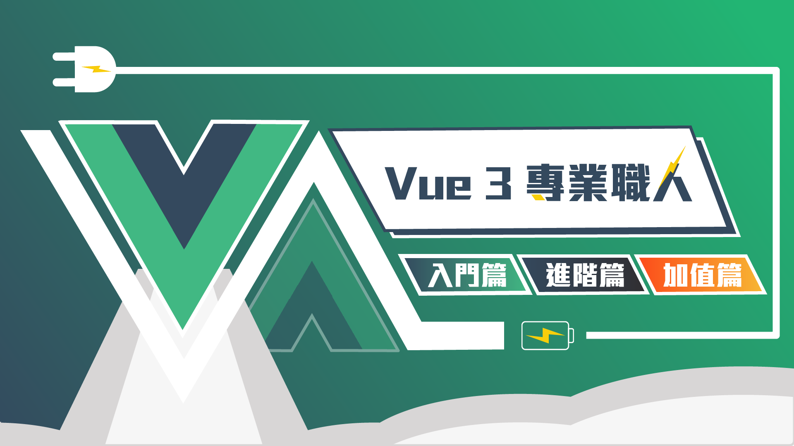

# 2020 Vue3 專業職人 | 入門篇

購課網址 : <a href="https://hiskio.com/packages/MQRmqYWR0" target="_blank">https://hiskio.com/packages/MQRmqYWR0</a>

 

### 這堂課適合的對象
- 有 HTML & CSS & JavaScript 實作基礎的同學
- 從 Vue2 想要轉移到 Vue3 的同學
- 沒有寫過任一前端框架的同學都適用

### 這堂課你將會學到
- 學會 Vue3 的使用方式以及基礎觀念
- 學會 Vuex 來做整個專案的狀態管理
- 學會使用 Vue-router 來開發使用者體驗優異的 SPA 網頁
- 學會一些業界實戰開發上面的經驗
- 學會如何規劃使用 API 的資料流
- 學習老師開發上面的思考邏輯以及實務經驗還有文件上面沒有寫的內容